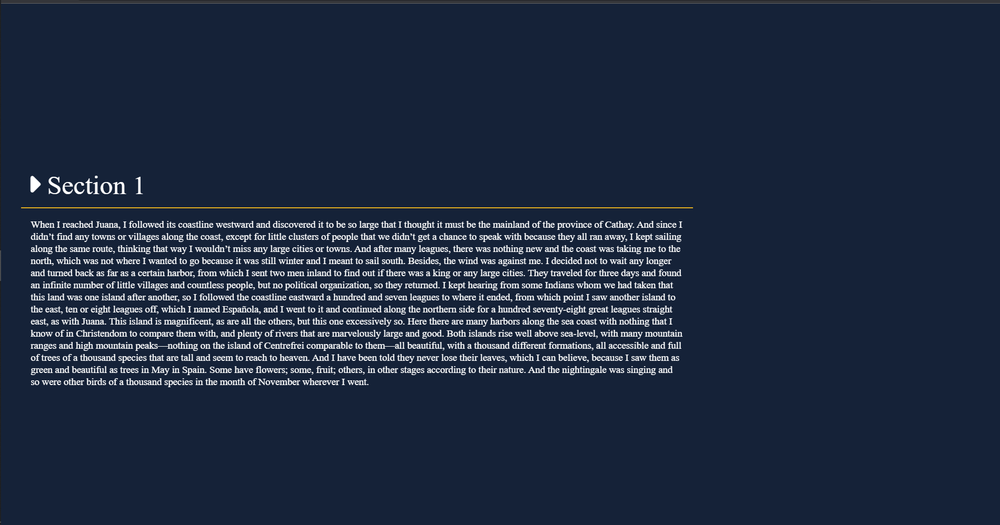
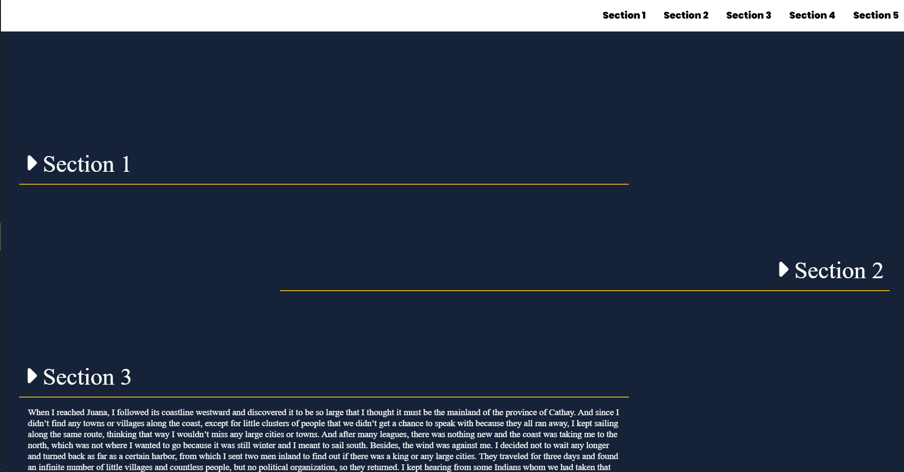
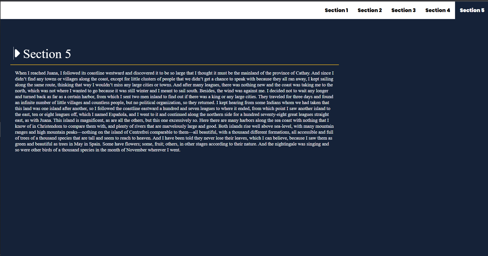

# loadingPage Project for Udacity ❤🤍❤

# Description:
This project contains a navbar and contains any number of sections you want, but by default I set it to be four sections, just by following some instructions you will be able to add any number of sections you want and I will take about these instructions later in .HTML file.

#Dependencies: please watch out that there are some files that must be found to make this project works in its expected way, images, CSS file, and js file.

#Instructions:
              **1:** To add more sections please realize there is a left section or a right section, by default way the section has to be a left section, but you can                                             change this to right by adding to the section class ''rightSection".
              **2:** You have to see the last section data-key and once you know that key you can increment it by one to give you the new data-key which will be available                                    for your new section.
              **3:** You must give it a name " 'section' + data-key"
              - **4:** In the circle class, while you build your section you must add a div class and give it a data-key and if the section is a right section you can give                                         it class "right"
**This the home page which you will see when you load the page:**

**This how each section looks like:**

**As you might notice the in before the word "Section 2" there is a arrow  the arrow by clicking on it this perticular section will collapes
and the page will look like this:**

**And there is also a navbar which allow to move on to a perticulae section in website, and by click on it, it moves to the section the you click on
and the navbar shows when you scrolling and it looks like this:**

#I used HTML and CSS and JavaScript to build this project

#Auther [Abdelrhman](https://twitter.com/Abdel_Elnabwi)
