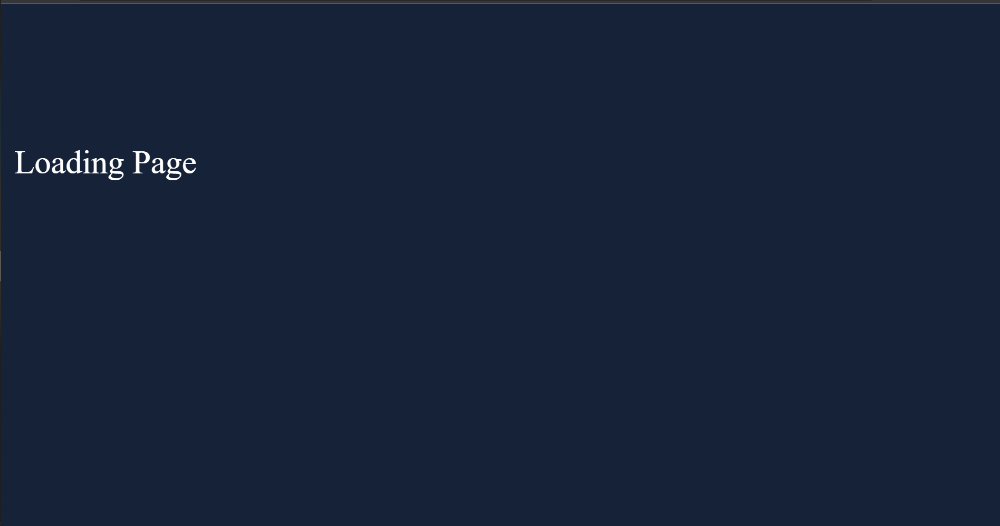

# loadingPage

This the home page which you will see when you load the page:

This how each section looks like:

As you might notice the in before the word "Section 2" there is a arrow  the arrow by clicking on it this perticular section will collapes
and the page will look like this:

